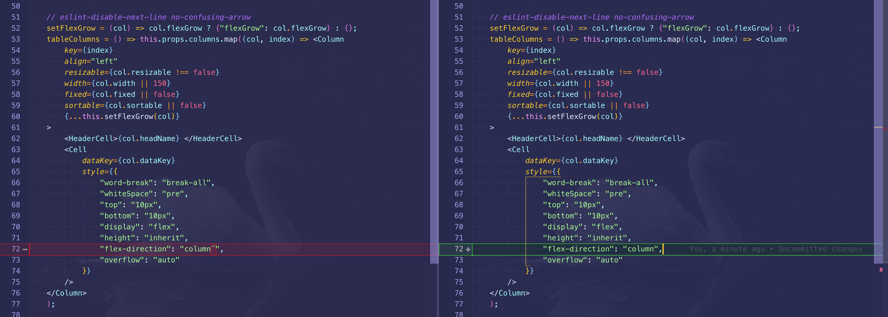

# Security
* [False-positive security precaution warning (`javascript:` URLs)](https://github.com/facebook/react/issues/16382)

# iFrame
* iFrame will effect browser history - [Posting HTML form to iframe causes problems with browser history](https://stackoverflow.com/questions/37058852/posting-html-form-to-iframe-causes-problems-with-browser-history/56913614#56913614)

- Illegal String in style will cause crash


# ThirdParty
* Materialize Date Picker automatically hide after opening problem on chrome
  * [google-support-chrome-thread](https://support.google.com/chrome/thread/3363391?hl=en)
  * [StackOverflow Solution](https://stackoverflow.com/questions/55200244/materialize-date-picker-automatically-hide-after-opening-problem-on-chrome)
```javascript
 function fixMaterializedDateOrTimePicker(){
    const chromeV = navigator.userAgent.match(/Chrome\/(\S+)/);
    if (chromeV){
        // Not sure when it'd been fixed, so just prevent the default on version bigger than 73
        const bigVersion = chromeV[1].split('.')[0];
        if (bigVersion>=73){
            $('.datepicker, .timepicker').on('mousedown',function(event){
                event.preventDefault();
            })
        }
    }
}
```
  
